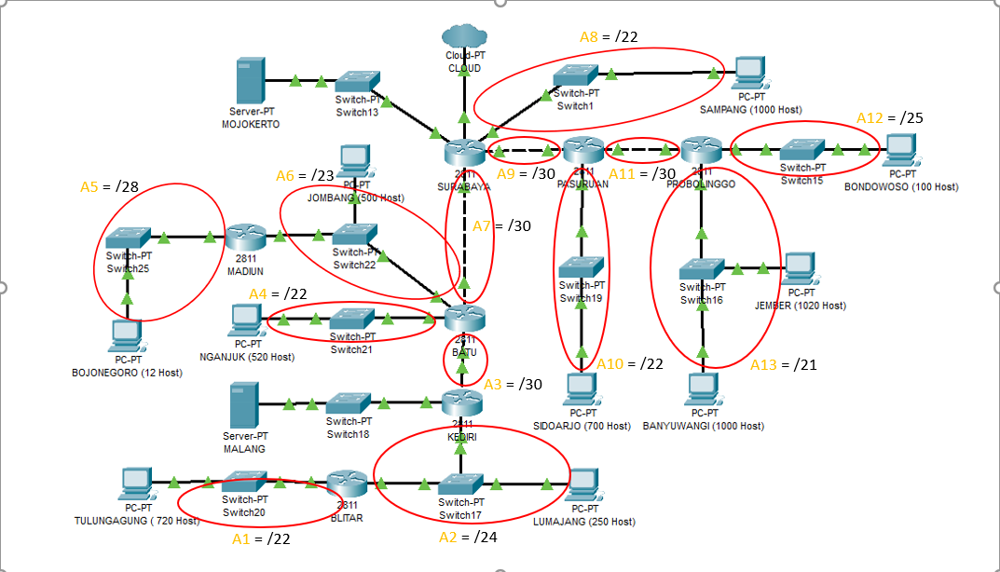
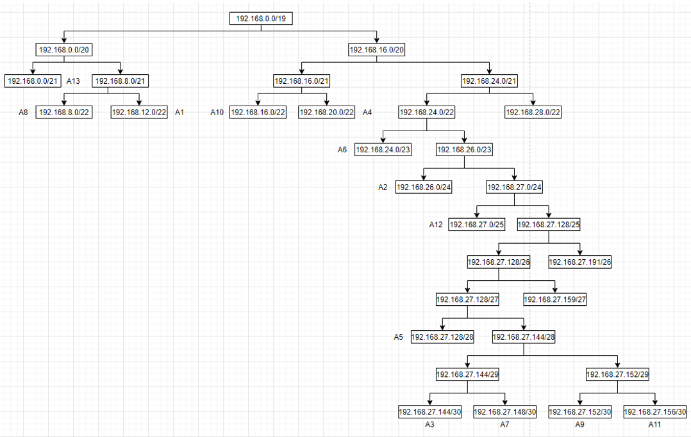
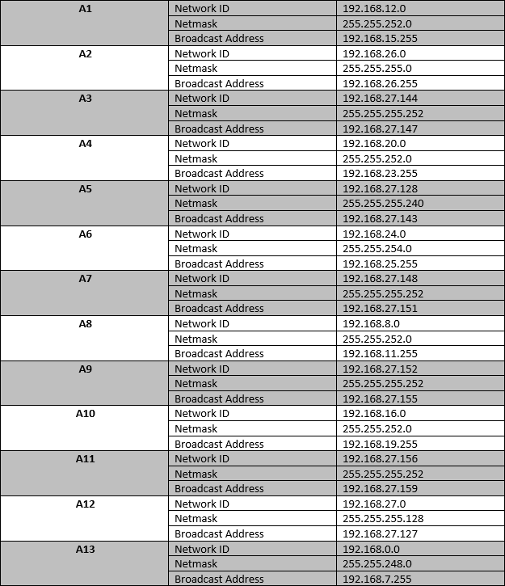

# Jarkom_Modul3_Lapres_D12
- Muhammad Ilham Bayhaqi - 05111840000069
- Clever Dicki Marpaung - 05111840000116

## CPT-VLSM
Untuk tree VLSM dibuatkan seperti berikut ini:

Tabel berikut menampilkan subnet dan jumlah IP untuk mendapatkan netmask tiap subnet:

| Subnet        | Jumlah IP     | Netmask |
| ------------- |:-------------:| -------:|
| A1            | 721           | /22     |
| A2            | 252           | /24     |
| A3            | 2             | /30     |
| A4            | 521           | /22     |
| A5            | 13            | /28     |
| A6            | 502           | /23     |
| A7            | 2             | /30     |
| A8            | 1001          | /22     |
| A9            | 2             | /30     |
| A10           | 701           | /22     |
| A11           | 2             | /30     |
| A12           | 101           | /25     |
| A13           | 2021          | /21     |
| TOTAL         | 5841          | /19     |

Dalam perhitungan NID dan Broadcast, disini digunakan dari IP terbesar terlebih dahulu. Dari hasil perhitungan didapatlah:

## UML-CIDR
