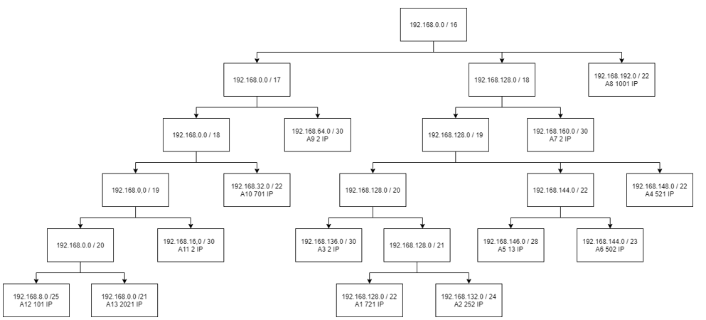
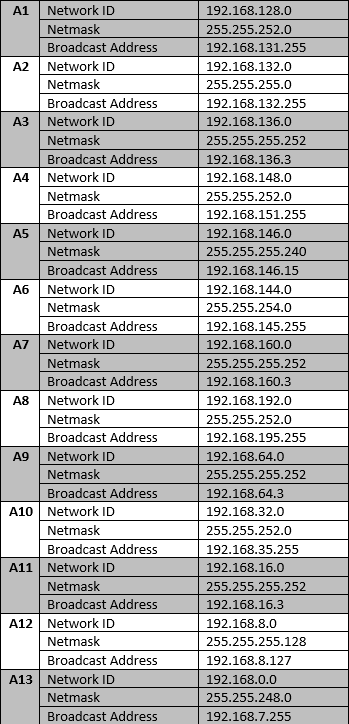

# Jarkom_Modul3_Lapres_D12
- Muhammad Ilham Bayhaqi - 05111840000069
- Clever Dicki Marpaung - 05111840000116


## CPT-VLSM
Untuk tree VLSM dibuatkan seperti berikut ini:


Tabel berikut menampilkan subnet dan jumlah IP untuk mendapatkan netmask tiap subnet:

| Subnet        | Jumlah IP     | Netmask |
| ------------- |:-------------:| -------:|
| A1            | 721           | /22     |
| A2            | 252           | /24     |
| A3            | 2             | /30     |
| A4            | 521           | /22     |
| A5            | 13            | /28     |
| A6            | 502           | /23     |
| A7            | 2             | /30     |
| A8            | 1001          | /22     |
| A9            | 2             | /30     |
| A10           | 701           | /22     |
| A11           | 2             | /30     |
| A12           | 101           | /25     |
| A13           | 2021          | /21     |
| TOTAL         | 5841          | /19     |

Dalam perhitungan NID dan Broadcast, disini digunakan dari IP terbesar terlebih dahulu. Dari hasil perhitungan didapatlah:


## UML-CIDR

Untuk tree CIDR dibuatkan seperti berikut ini:



Dari hasil perhitungan NID dan Broadcast, didapatlah:



Untuk implementasi pada UML maka dibuatkan topologi dengan script sebagai berikut.

```
uml_switch -unix switch1 > /dev/null < /dev/null &
uml_switch -unix switch13 > /dev/null < /dev/null &
uml_switch -unix switch15 > /dev/null < /dev/null &
uml_switch -unix switch25 > /dev/null < /dev/null &
uml_switch -unix switch22 > /dev/null < /dev/null &
uml_switch -unix switch19 > /dev/null < /dev/null &
uml_switch -unix switch16 > /dev/null < /dev/null &
uml_switch -unix switch21 > /dev/null < /dev/null &
uml_switch -unix switch18 > /dev/null < /dev/null &
uml_switch -unix switch20 > /dev/null < /dev/null &
uml_switch -unix switch17 > /dev/null < /dev/null &
uml_switch -unix switch2 > /dev/null < /dev/null &
uml_switch -unix switch3 > /dev/null < /dev/null &
uml_switch -unix switch4 > /dev/null < /dev/null &
uml_switch -unix switch5 > /dev/null < /dev/null &

#Router
xterm -T SURABAYA -e linux ubd0=SURABAYA,jarkom umid=SURABAYA eth0=tuntap,,,10.151.78.53 eth1=daemon,,,switch1 eth2=daemon,,,switch2  eth3=daemon,,,switch4 eth4=daemon,,,switch13 mem=64M&
xterm -T PASURUAN -e linux ubd0=PASURUAN,jarkom umid=PASURUAN eth0=daemon,,,switch2 eth1=daemon,,,switch3 eth2=daemon,,,switch19 mem=64M &
xterm -T PROBOLINGGO -e linux ubd0=PROBOLINGGO,jarkom umid=PROBOLINGGO eth0=daemon,,,switch3 eth1=daemon,,,switch15 eth2=daemon,,,switch16 mem=64M &
xterm -T BATU -e linux ubd0=BATU,jarkom umid=BATU eth0=daemon,,,switch4 eth1=daemon,,,switch5 eth2=daemon,,,switch21 eth3=daemon,,,switch22 mem=64M &
xterm -T KEDIRI -e linux ubd0=KEDIRI,jarkom umid=KEDIRI eth0=daemon,,,switch5 eth1=daemon,,,switch17 eth2=daemon,,,switch18 mem=64M &
xterm -T MADIUN -e linux ubd0=MADIUN,jarkom umid=MADIUN eth0=daemon,,,switch22 eth1=daemon,,,switch25 mem=64M &
xterm -T BLITAR -e linux ubd0=BLITAR,jarkom umid=BLITAR eth0=daemon,,,switch17 eth1=daemon,,,switch20 mem=64M &

#Server
xterm -T MALANG -e linux ubd0=MALANG,jarkom umid=MALANG eth0=daemon,,,switch18 mem=64M &
xterm -T MOJOKERTO -e linux ubd0=MOJOKERTO,jarkom umid=MOJOKERTO eth0=daemon,,,switch13 mem=64M &

#Client
xterm -T SAMPANG -e linux ubd0=SAMPANG,jarkom umid=SAMPANG eth0=daemon,,,switch1 mem=64M &
xterm -T BONDOWOSO -e linux ubd0=BONDOWOSO,jarkom umid=BONDOWOSO eth0=daemon,,,switch15 mem=64M &
xterm -T JEMBER -e linux ubd0=JEMBER,jarkom umid=JEMBER eth0=daemon,,,switch16 mem=64M &
xterm -T BANYUWANGI -e linux ubd0=BANYUWANGI,jarkom umid=BANYUWANGI eth0=daemon,,,switch16 mem=64M &
xterm -T SIDOARJO -e linux ubd0=SIDOARJO,jarkom umid=SIDOARJO eth0=daemon,,,switch19 mem=64M &
xterm -T JOMBANG -e linux ubd0=JOMBANG,jarkom umid=JOMBANG eth0=daemon,,,switch22 mem=64M &
xterm -T BOJONEGORO -e linux ubd0=BOJONEGORO,jarkom umid=BOJONEGORO eth0=daemon,,,switch25 mem=64M &
xterm -T NGANJUK -e linux ubd0=NGANJUK,jarkom umid=NGANJUK eth0=daemon,,,switch21 mem=64M &
xterm -T TULUNGAGUNG -e linux ubd0=TULUNGAGUNG,jarkom umid=TULUNGAGUNG eth0=daemon,,,switch20 mem=64M &
xterm -T LUMAJANG -e linux ubd0=LUMAJANG,jarkom umid=LUMAJANG eth0=daemon,,,switch17 mem=64M &
```

Pada file ```/etc/sysctl.conf``` di setiap router yaitu pada UML **SURABAYA**, **PASURUAN**, **PROBOLINGGO**, **BATU**, **KEDIRI**, **MADIUN**, **BLITAR** dibuat agar dapat melakukan packet forwarding IPv4 dengan melakukan *uncomment* pada ```net.ipv4.forward=1``` sebagai berikut.


Untuk melakukan pembagian IP pada setiap Host maka dilakukan konfigurasi pada ```/etc/network/interfaces``` tiap host dan routing untuk setiap router sebagai berikut.

- SURABAYA
```
auto lo
iface lo inet loopback

auto eth0
iface eth0 inet static
address 10.151.78.54
netmask 255.255.255.252
gateway 10.151.78.53

auto eth1
iface eth1 inet static
address 192.168.192.1
netmask 255.255.252.0

auto eth2
iface eth2 inet static
address 192.168.64.1
netmask 255.255.255.252

auto eth3
iface eth3 inet static
address 192.168.160.1
netmask 255.255.255.252

auto eth4
iface eth4 inet static
address 10.151.79.105
netmask 255.255.255.252
```

Pada SURABAYA routingnya sebagai berikut

```
route add -net 192.168.128.0 netmask 255.255.224.0 gw 192.168.160.2
route add -net 192.168.0.0 netmask 255.255.192.0 gw 192.168.64.2
route add -net 10.151.79.108 netmask 255.255.255.252 gw 192.168.160.2
```

- PASURUAN
```
auto lo
iface lo inet loopback

auto eth0
iface eth0 inet static
address 192.168.64.2
netmask 255.255.255.252

auto eth1
iface eth1 inet static
address 192.168.16.1
netmask 255.255.255.252

auto eth2
iface eth2 inet static
address 192.168.32.1
netmask 255.255.252.0
```

Pada PASURUAN, routingnya sebagai berikut.

```
route add -net 0.0.0.0 netmask 0.0.0.0 gw 192.168.64.1
route add -net 192.168.0.0 netmask 255.255.240.0 gw 192.168.16.2
```

- PROBOLINGGO
```
auto lo
iface lo inet loopback

auto eth0
iface eth0 inet static
address 192.168.16.2
netmask 255.255.255.252

auto eth1
iface eth1 inet static
address 192.168.8.1
netmask 255.255.255.128

auto eth2
iface eth2 inet static
address 192.168.0.1
netmask 255.255.248.0
```
Pada PROBOLINGGO, routingnya sebagai berikut.
```
route add -net 0.0.0.0 netmask 0.0.0.0 gw 192.168.16.1
```
- #BATU
```
auto lo
iface lo inet loopback

auto eth0
iface eth0 inet static
address 192.168.160.2
netmask 255.255.255.252

auto eth1
iface eth1 inet static
address 192.168.136.1
netmask 255.255.255.252

auto eth2
iface eth2 inet static
address 192.168.148.1
netmask 255.255.252.0

auto eth3
iface eth3 inet static
address 192.168.144.1
netmask 255.255.254.0

--

route add -net 0.0.0.0 netmask 0.0.0.0 gw 192.168.160.1
route add -net 192.168.146.0 netmask 255.255.255.240 gw 192.168.144.2
route add -net 192.168.128.0 netmask 255.255.248.0 gw 192.168.136.2
route add -net 10.151.79.108 netmask 255.255.255.252 gw 192.168.136.2

--

#KEDIRI

auto lo
iface lo inet loopback

auto eth0
iface eth0 inet static
address 192.168.136.2
netmask 255.255.255.252

auto eth1
iface eth1 inet static
address 192.168.132.1
netmask 255.255.255.0

auto eth2
iface eth2 inet static
address 10.151.79.109
netmask 255.255.255.252

--

route add -net 0.0.0.0 netmask 0.0.0.0 gw 192.168.136.1
route add -net 192.168.128.0 netmask 255.255.252.0 gw 192.168.132.2

--

#MADIUN

auto lo
iface lo inet loopback

auto eth0
iface eth0 inet static
address 192.168.144.2
netmask 255.255.254.0

auto eth1
iface eth1 inet static
address 192.168.146.1
netmask 255.255.255.240

--

route add -net 0.0.0.0 netmask 0.0.0.0 gw 192.168.144.1

--

#BLITAR

auto lo
iface lo inet loopback

auto eth0
iface eth0 inet static
address 192.168.132.2
netmask 255.255.255.0

auto eth1
iface eth1 inet static
address 192.168.128.1
netmask 255.255.252.0

-

route add -net 0.0.0.0 netmask 0.0.0.0 gw 192.168.132.1

-

--------------------
#MALANG

auto lo
iface lo inet loopback

auto eth0
iface eth0 inet static
address 10.151.79.110
netmask 255.255.255.252
gateway 10.151.79.109

-

#MOJOKERTO

auto lo
iface lo inet loopback

auto eth0
iface eth0 inet static
address 10.151.79.106
netmask 255.255.255.252
gateway 10.151.79.105

-

--------------------
#SAMPANG

auto lo
iface lo inet loopback

auto eth0
iface eth0 inet static
address 192.168.192.2
netmask 255.255.252.0
gateway 192.168.192.1

-

#BONDOWOSO

auto lo
iface lo inet loopback

auto eth0
iface eth0 inet static
address 192.168.8.2
netmask 255.255.255.128
gateway 192.168.8.1

-

#JEMBER

auto lo
iface lo inet loopback

auto eth0
iface eth0 inet static
address 192.168.4.1
netmask 255.255.248.0
gateway 192.168.0.1

-

#BANYUWANGI

auto lo
iface lo inet loopback

auto eth0
iface eth0 inet static
address 192.168.0.2
netmask 255.255.248.0
gateway 192.168.0.1

-

#SIDOARJO

auto lo
iface lo inet loopback

auto eth0
iface eth0 inet static
address 192.168.32.2
netmask 255.255.252.0
gateway 192.168.32.1

-

#JOMBANG

auto lo
iface lo inet loopback

auto eth0
iface eth0 inet static
address 192.168.144.3
netmask 255.255.254.0
gateway 192.168.144.1

-

#BOJONEGORO

auto lo
iface lo inet loopback

auto eth0
iface eth0 inet static
address 192.168.146.2
netmask 255.255.254.0
gateway 192.168.146.1

-

#NGANJUK

auto lo
iface lo inet loopback

auto eth0
iface eth0 inet static
address 192.168.148.2
netmask 255.255.252.0
gateway 192.168.148.1

-

#TULUNGAGUNG

auto lo
iface lo inet loopback

auto eth0
iface eth0 inet static
address 192.168.128.2
netmask 255.255.252.0
gateway 192.168.128.1

-

#LUMAJANG

auto lo
iface lo inet loopback

auto eth0
iface eth0 inet static
address 192.168.132.3
netmask 255.255.255.0
gateway 192.168.132.1
```
